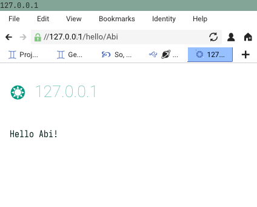

# Mercury

*A framework for writing Go applications using the Gemini protocol*

[](https://pkg.go.dev/github.com/codemicro/mercury) [](https://goreportcard.com/report/github.com/codemicro/mercury)

---

Mercury is a simple framework that lets you build internat applications that make use of [the Gemini protocol](https://gemini.circumlunar.space/) in Golang. 

## Features

* Middleware
* URL parameters
* Full Gemini v0.16.1 support

## Example

```go
func run() error {
	app, err := mercury.New(
		mercury.WithX509KeyPair("cert.pem", "key.pem"),
	)
	if err != nil {
		return err
	}

	app.Add("/hello", func(ctx *mercury.Ctx) error {
		ctx.SetBody("Hello world!")
		return nil
	})

	app.Add("/hello/:name", func(ctx *mercury.Ctx) error {
		var sb strings.Builder
		ctx.SetBodyBuilder(&sb)
		
		sb.WriteString("Hello ")
		sb.WriteString(ctx.GetURLParam("name"))
		sb.WriteRune('!')
		return nil
	})

	shutdownChan := make(chan os.Signal)
	signal.Notify(shutdownChan, syscall.SIGINT)
	go func() {
		<-shutdownChan
		_ = app.Shutdown()
	}()

	return app.Listen(":1965")
}
```



## Install

```
go get github.com/codemicro/mercury
```

## This is quite young

This package is still in its early phases. It's probably okay to use, because honestly you're not doing anything aside from hobby projects with Gemini, but if you run into issues or weird behaviour from Mercury, try checking for new updates before much else.

## Footnotes

Issues and pull requests are welcome, though if you're going to do a lot of work for a pull request, please open an issue or discussion to talk it over first.

The API of this package is inspired by that of [Fiber](https://github.com/gofiber/fiber).

This project is licensed under the MIT license. See [LICENSE](LICENSE) for more information.